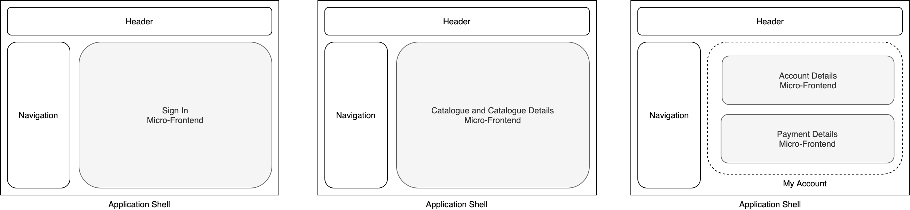

### UI example

This example micro-frontends is structured as:

- an application shell for hosting all the micro-frontends
- a sign in micro-frontend
- a catalogue micro-frontend with multiple views
- a my account micro-frontend that is loading 2 micro-frontends: account details and payments details

